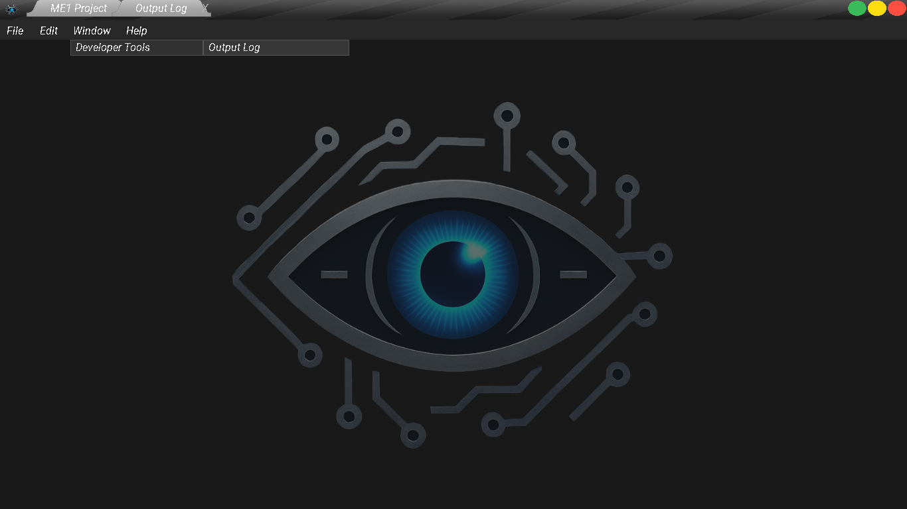
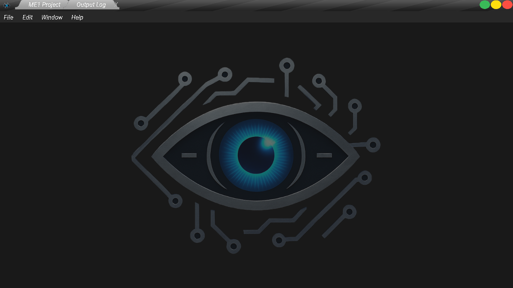

\# MuxEngine v0.1.0


Estado actual

🔧 En desarrollo – fase de arquitectura y pruebas.

EN ESTA RAMA SE MUESTRAN LOS ARCHIVOS YA LISTOS PARA USAR .

✨ Autor

Creado por Thory, programador independiente de motores de juego.


\*\*MuxEngine\*\* es un motor de videojuegos 2D y 3D en desarrollo, hecho desde cero en C++ utilizando SDL2, OpenGL y otras librerías. Su objetivo es ser un motor modular, ligero y potente, ideal para crear juegos indie con herramientas visuales similares a Blueprint de Unreal Engine 4.27.2 .


\## 🚀 Características actuales


\- Renderizado 2D con OpenGL 4.6

\- Sistema de ventanas con SDL2

\- Interfaz visual usando SDL2 - NUNCA NUNCA Imgui

\- Entrada de teclado y ratón básica

\- Estructura modular del motor por componentes

\- Sistema de cambio de idioma INGLES Y ESPAÑOL

\- Rutas de los Assets del Editor cambiadas a Globales en un solo archivo .h

\- Sistema de Pestañas 

\- En camino: editor visual integrado


\## 🧪 Tecnologías usadas


\- C++20

\- SDL2

\- OpenGL4.6

\- GLAD

\- GLM

\- stb\_image


\## 🗂️ Estructura del proyecto


\- `include/` – Librerías externas

\- `src/` – Código fuente de Headers y cpp propios del motor

\- `lib/` – Librerías precompiladas (.dll, .lib)

\- `editor/` – Editor visual (en desarrollo)

\- `assets/` – Texturas, sonidos, fuentes de prueba

\- `docs/` – Ideas, diseño técnico, notas


AUN ESTAMOS EMPEZANDO







\## ⚙️ Compilación con CMake


```bash

mkdir build

cd build

cmake ..

cmake ..

cmake --build .


